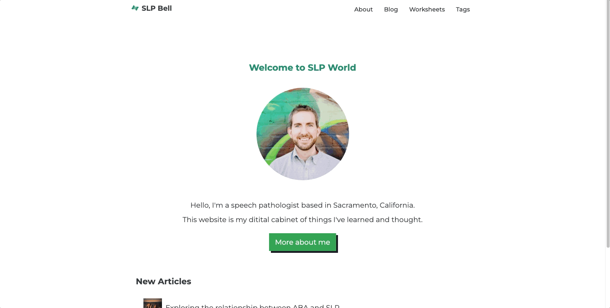

# SLP Blog

A blog for a speech therapist. The blog is built with Gatsby. The blog owner can publish contents with markdown. Users can search articles and workseets by category, search bar, and tags. 

[Live Demo](https://slp-blog.netlify.app/)


## Lessons Learned

- Gatsby framework
- GraphQL
- CSS modules


## Demo



## Run Locally

Install

```bash
  yarn
```
Start app 
```bash
  gatsby develop
```


